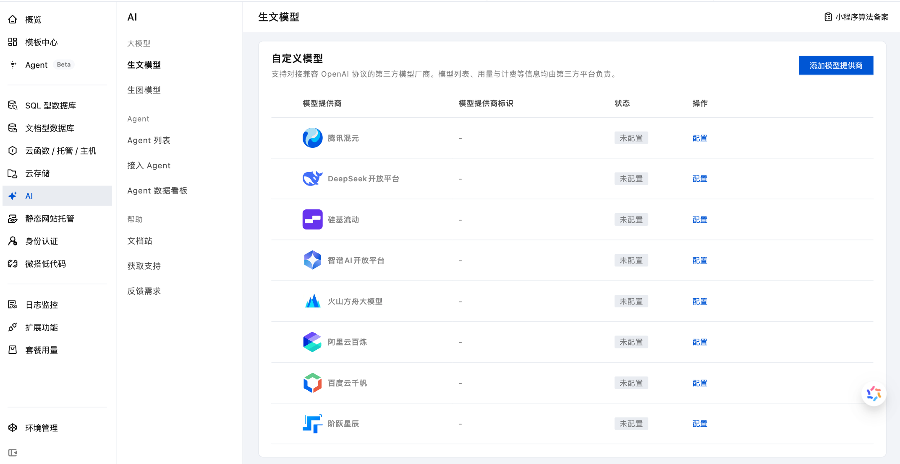
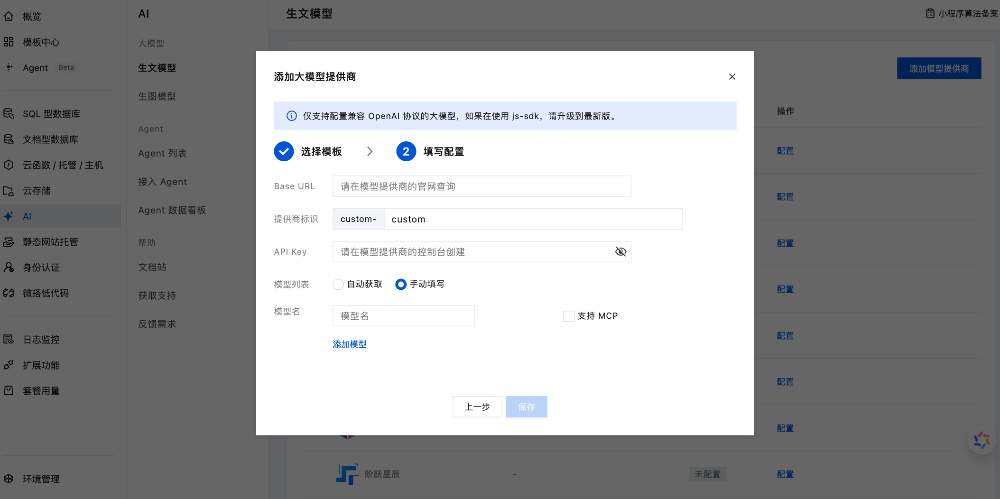
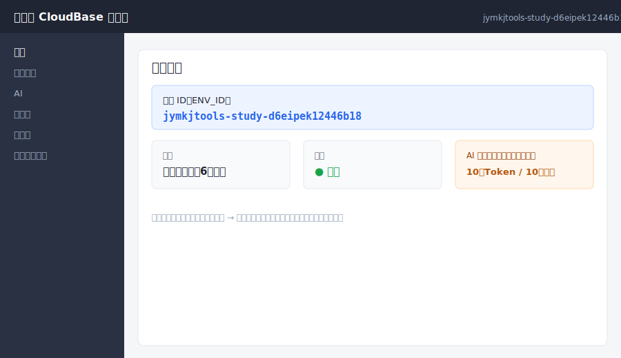
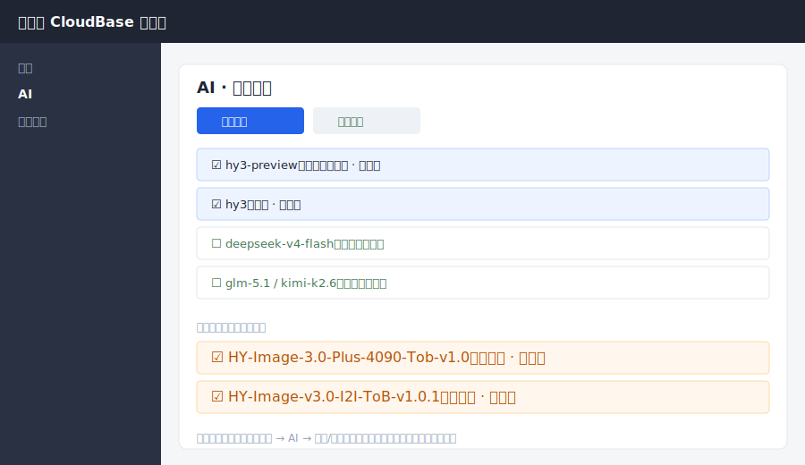
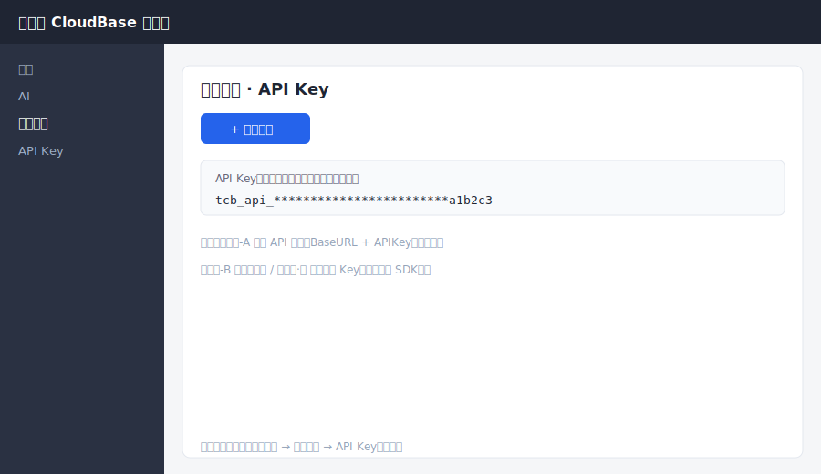
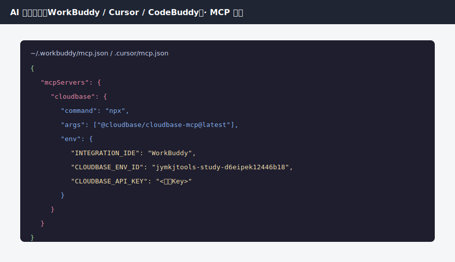

# 微信 AI 小程序成长计划 · 4 个免费模型 · 三种合规调用方式 培训教程

> 本文档为技术培训资料，面向学生 / 独立开发者，手把手讲清楚如何**合规**地把「微信 AI 小程序成长计划」免费模型额度用起来。
>
> - 云环境 ID：`jymkjtools-study-d6eipek12446b18`
> - 免费模型（共 4 个）：
>   - 文本：`hy3-preview`（混元指令模型）、`hy3`
>   - 图像：`HY-Image-3.0-Plus-4090-Tob-v1.0`（文生图）、`HY-Image-v3.0-I2I-ToB-v1.0.1`（图生图）
> - 免费额度：文本 **10 亿 Token**、图像 **10 万张**（资源包自申请成功起 6 个月有效）

---

## 目录
1. [核心概念与合规原理（必读）](#0-核心概念与合规原理必读)
2. [环境准备：开通环境、报名计划、开启模型、拿 Key](#1-环境准备)
3. [方式一：云函数 / 服务端 Node SDK（已配置 + 已验证）](#2-方式一云函数--服务端-node-sdk已配置已验证)
4. [方式二：微信小程序端 SDK（wx.cloud.extend.AI）](#3-方式二微信小程序端-sdk)
5. [方式三：AI 工具接入（OpenAI 兼容 + CloudBase 官方 MCP）](#4-方式三ai-工具接入openai-兼容--cloudbase-官方-mcp)
6. [4 个免费模型调用速查表](#5-4-个免费模型调用速查表)
7. [合规自检清单与常见错误](#6-合规自检清单与常见错误)
8. [官方参考资料](#7-官方参考资料)

---

## 0. 核心概念与合规原理（必读）

### 0.1 什么是「微信 AI 小程序成长计划」
腾讯云开发（CloudBase）联合微信推出的扶持计划：报名后免费获得 **6 个月个人版云开发环境** + **AI 资源包**（文本 10 亿 Token、图像 10 万张），模型升级为混元最新 **Hy3** 与 **Hy Image 3.0** 生图模型。

> 官方说明（小程序成长计划）：*AI 资源包仅限小程序和云函数中使用，其他来源均不可使用。*
> 来源：https://docs.cloudbase.net/ai/ai-inspire-plan

### 0.2 四种调用方式？不，是三种「合规来源」
云开发 AI 提供多种接入形态（小程序 SDK、wx-server-sdk、Web SDK、Node SDK、cURL、OpenAI SDK、Anthropic SDK），但**能消耗免费「小程序成长计划」额度的合法来源只有两类**：

- **来源 A：微信小程序**（`wx.cloud.extend.AI`）
- **来源 B：云函数 / 云开发服务端**（`@cloudbase/node-sdk` 的 `app.ai()`）

其余形态（直接拿 API Key 在任意后端/AI 工具里调 REST API）消耗的是**资源点套餐 / 代金券**，是另一套额度——**合规，但不再免费**。

### 0.3 三种合规调用方式总览

| 方式 | 调用落点 | 合法来源 | 额度 | 适合场景 |
|------|----------|----------|------|----------|
| **方式一**：云函数 / 服务端 Node SDK | 云函数内 `app.ai()` | B（云函数） | 免费 | 网页 / 小程序后端 / API 服务 |
| **方式二**：微信小程序端 SDK | 小程序内 `wx.cloud.extend.AI` | A（小程序） | 免费 | 纯小程序应用 |
| **方式三-A**：AI 工具直连 API 网关 | BaseURL + APIKey | 无（外部） | 资源点套餐 | 快速接 Cursor/Claude；接受付费 |
| **方式三-B**：AI 工具 → 云函数桥接 | AI 工具调你的云函数 → `app.ai()` | B（云函数） | 免费 | 想免费用 AI 工具调模型 |

> **关键原理一句话**：免费额度看的是「**这次模型调用最终发生在哪里**」，而不是「谁发起的」。发生在小程序或云函数里 → 免费；发生在你自己的普通服务器里 → 走资源点套餐。方式三-B 的精髓就是：让 AI 工具去调你的**云函数**，把模型调用"搬回"云端合法来源。

### 0.4 模型概览（官方图示）

> 以下为 CloudBase 官方「大模型接入」文档中的说明图，展示多调用方式与模型支持范围：




---

## 1. 环境准备

### 步骤 1.1 开通 CloudBase 环境
1. 打开 CloudBase 官网注册并登录：https://cloudbase.net
2. 创建首个**个人版环境**（报名成长计划可免费获得 6 个月；已有环境会自动升级或领取 120 元代金券）。
3. 记录**环境 ID（ENV_ID）**——本教程用 `jymkjtools-study-d6eipek12446b18`。



### 步骤 1.2 报名「微信 AI 小程序成长计划」领取额度
- 路径：**微信公众平台 → 行业能力 → 小程序成长计划** 报名。
- 报名后 Token 与生图额度自动到账（或领取代金券）。
- 全行业开放，不限制类目。

### 步骤 1.3 在控制台开启所需模型（必做，否则调用报"模型未开启"）
1. 进入 **CloudBase 控制台 → AI → 生文模型**，勾选 `hy3-preview`、`hy3`。
2. 切到 **生图模型**，开启 `HY-Image-3.0-Plus-4090-Tob-v1.0`（文生图）与 `HY-Image-v3.0-I2I-ToB-v1.0.1`（图生图）。
   > 官方原文：*生文模型：使用 ai.createModel("cloudbase")，model 传 hy3 或 hy3-preview。生图模型：使用 ai.createImageModel("hunyuan-image")，model 传 HY-Image-3.0-Plus-4090-Tob-v1.0。生图仅支持在云函数 / 云托管中调用。*



### 步骤 1.4 获取环境 ID 与（按需）创建 API Key
- **环境 ID**：控制台「概览」复制，全部方式都要用。
- **API Key**：仅**方式三-A 直连 API 网关**需要。路径：**控制台 → 环境配置 → API Key → 创建密钥**。Key 仅创建时可见一次，务必保存。



### 步骤 1.5 安装 CloudBase CLI
```bash
npm install -g @cloudbase/cli
tcb login          # 首次会打开浏览器授权
tcb env list       # 确认能看到 jymkjtools-study-d6eipek12446b18
```
> 官方 CLI / MCP 安装文档：https://docs.cloudbase.net/ai/cloudbase-ai-toolkit/faq

---

## 2. 方式一：云函数 / 服务端 Node SDK（已配置 + 已验证）

> **状态：已在本项目 `aibak-cloudbase-ai` 中配置并成功调用。** 这就是教程开头说的"已配置的一种"。

### 2.1 架构
```
浏览器 / 小程序
   │  HTTPS (fetch)
   ▼
云函数 ai-chat / ai-image  ──(@cloudbase/node-sdk app.ai())──▶  混元模型
   │                                                  合法来源=云函数 → 免费额度
   ▼
返回结果
```

### 2.2 文本云函数 `ai-chat/index.js`（关键片段）
```js
const tcb = require("@cloudbase/node-sdk");
const app = tcb.init({ env: "jymkjtools-study-d6eipek12446b18", timeout: 60000 });

exports.main = async (event) => {
  let inputData = event;
  if (event.httpMethod === "POST" && event.body) inputData = JSON.parse(event.body);

  const { messages, model = "hy3" } = inputData;
  // 模型白名单：只放免费文本模型
  const ALLOWED_MODELS = ["hy3", "hy3-preview"];
  if (!ALLOWED_MODELS.includes(model))
    return { statusCode: 400, body: JSON.stringify({ success: false, error: "unsupported model" }) };

  const ai = app.ai();
  const aiModel = ai.createModel("cloudbase");        // ← 合法来源=云函数
  const res = await aiModel.generateText({ model, messages });
  return { statusCode: 200, body: JSON.stringify({ success: true, text: res.text, usage: res.usage }) };
};
```

### 2.3 图像云函数 `ai-image/index.js`（关键片段）
```js
const tcb = require("@cloudbase/node-sdk");
const app = tcb.init({ env: "jymkjtools-study-d6eipek12446b18", timeout: 180000 });

const ALLOWED_MODELS = [
  "HY-Image-3.0-Plus-4090-Tob-v1.0",  // 文生图
  "HY-Image-v3.0-I2I-ToB-v1.0.1",     // 图生图
];

exports.main = async (event) => {
  let inputData = event;
  if (event.httpMethod === "POST" && event.body) inputData = JSON.parse(event.body);
  const { prompt, model, size = "1024x1024", images, image_urls } = inputData;

  const isI2I = model.includes("I2I");
  if (isI2I && !(images || image_urls))
    return { statusCode: 400, body: JSON.stringify({ success: false, error: "图生图需传底图" }) };

  const ai = app.ai();
  const imageModel = ai.createImageModel("hunyuan-image");   // ← 合法来源=云函数
  const res = await imageModel.generateImage({
    model, prompt, size,
    ...(isI2I ? {} : { enable_thinking: { value: false } }),
    ...(images ? { images } : {}),
    ...(image_urls ? { image_urls } : {}),
  });
  return { statusCode: 200, body: JSON.stringify({ success: true, data: res.data, quotaSource: "小程序成长计划免费额度" }) };
};
```

### 2.4 部署与验证
```bash
cd method-1-cloud-function
tcb fn deploy ai-chat
tcb fn deploy ai-image
```
部署后通过 HTTP 触发器调用（`cloudbaserc.json` 已声明两个函数）。返回体中 `quotaSource: "小程序成长计划免费额度"` 即证明走的是免费额度。

---

## 3. 方式二：微信小程序端 SDK

> **状态：已配好示例代码**（`method-2-miniprogram/`）。合法来源 = 小程序，消耗免费额度。

### 3.1 架构
```
微信小程序（用户手机）
   │  wx.cloud.extend.AI.createModel('cloudbase')
   ▼
云开发 AI（混元 hy3 / HY-Image）
   ↑ 合法来源=小程序 → 免费额度
```

### 3.2 前置条件
- 微信小程序基础库 **>= 3.15.1**
- 已在「微信开发者工具 → 云开发 → AI」开启模型（见步骤 1.3）
- 小程序已与云开发环境绑定

### 3.3 代码 `app.js`（初始化）
```js
App({
  onLaunch() {
    wx.cloud.init({ env: "jymkjtools-study-d6eipek12446b18", traceUser: true });
  },
});
```

### 3.4 代码 `pages/chat/chat.js`（文本 + 图像）
```js
Page({
  data: { messages: [], inputValue: "", isLoading: false, model: "hy3-preview" },

  async sendMessage() {
    const { inputValue, messages, model } = this.data;
    if (!inputValue.trim() || this.data.isLoading) return;
    const next = [...messages, { role: "user", content: inputValue }];
    this.setData({ messages: next, inputValue: "", isLoading: true });
    try {
      const ai = wx.cloud.extend.AI;
      const m = ai.createModel("cloudbase");
      const res = await m.streamText({ data: { model, messages: next } });
      let acc = "";
      for await (const t of res.textStream) {
        acc += t;
        this.setData({ messages: [...next, { role: "assistant", content: acc }] });
      }
    } catch (e) {
      this.setData({ messages: [...next, { role: "assistant", content: "失败：" + e.message }] });
    } finally { this.setData({ isLoading: false }); }
  },

  async generateImage() {
    const prompt = this.data.inputValue.trim();
    if (!prompt) return;
    const img = wx.cloud.extend.AI.createImageModel("hunyuan-image");
    const r = await img.generateImage({ model: "HY-Image-3.0-Plus-4090-Tob-v1.0", prompt, size: "1024x1024" });
    wx.previewImage({ urls: [r.data[0].url] });   // 文生图结果
  },
});
```
> 图生图同理：`createImageModel('hunyuan-image').generateImage({ model: 'HY-Image-v3.0-I2I-ToB-v1.0.1', prompt, images: [base64] })`。

### 3.5 运行步骤（微信开发者工具）
1. 用「微信开发者工具」打开 `method-2-miniprogram/`。
2. 在 `project.config.json` 填你的小程序 **AppID**，在 `app.js` 填环境 ID。
3. 点顶部「云开发」→ 开通 / 选择环境 `jymkjtools-study-d6eipek12446b18`。
4. 编译，在模拟器输入消息 → 流式对话（hy3-preview）；点「生图」→ 调用混元生图。

### 3.6 验证
对话返回文本、生图弹出图片，即证明小程序端免费额度调用成功。用量可在「云开发 → AI」模块查看，达 80%/90%/100% 会收到公众号提醒。

> 官方小程序快速开始：https://developers.weixin.qq.com/miniprogram/dev/wxcloudservice/wxcloud/guide/ai/QuickStart.html

---

## 4. 方式三：AI 工具接入（OpenAI 兼容 + CloudBase 官方 MCP）

### 4.0 先看清两条子路径的额度差异
| 子路径 | 怎么接 | 额度 |
|--------|--------|------|
| **三-A 直连 API 网关** | 在工具填 BaseURL + APIKey，直接调 REST | 资源点套餐（非免费） |
| **三-B 云函数桥接** | 工具调你的 `ai-proxy` 云函数 → `app.ai()` | **免费额度** |

按需求二选一。想"免费且合规"选 **三-B**。

### 4.1 三-A：直连 API 网关（资源点套餐额度）
1. 创建 API Key（步骤 1.4）。
2. 在工具里填（以 WorkBuddy / Cursor / CodeBuddy 为例）：
   - **Base URL**：`https://jymkjtools-study-d6eipek12446b18.api.tcloudbasegateway.com/v1/ai/cloudbase`
   - **API Key**：你创建的 Key
   - **模型**：`hy3-preview`
3. 代码见 `method-3-ai-tools/openai-client.js`：
```js
import OpenAI from "openai";
const client = new OpenAI({
  apiKey: process.env.CLOUDBASE_API_KEY,
  baseURL: "https://jymkjtools-study-d6eipek12446b18.api.tcloudbasegateway.com/v1/ai/cloudbase",
});
const res = await client.chat.completions.create({ model: "hy3-preview", messages: [{ role: "user", content: "你好" }] });
console.log(res.choices[0].message.content);
```
> 协议支持 Chat Completions / Responses / Anthropic Messages，凡支持自定义接口的工具都可接。
> 官方文档：https://docs.cloudbase.net/ai/quickstart/ai-tools ｜ https://docs.cloudbase.net/ai/model/openai-sdk-access

### 4.2 三-B：云函数桥接（免费额度，推荐）
把"模型调用"放进云函数，AI 工具只管调你的云函数地址。代码见 `method-3-ai-tools/ai-proxy/index.js`（核心即方式一的 `app.ai()` 调用，增加 `type` 区分文本/图像）。

调用示例（AI 工具里发 HTTP 即可）：
```json
// 文本
{ "type": "text", "model": "hy3-preview", "messages": [{ "role": "user", "content": "你好" }] }
// 文生图
{ "type": "image", "model": "HY-Image-3.0-Plus-4090-Tob-v1.0", "prompt": "赛博朋克猫", "size": "1024x1024" }
// 图生图
{ "type": "image", "model": "HY-Image-v3.0-I2I-ToB-v1.0.1", "prompt": "转水彩", "images": ["<base64>"] }
```
部署：
```bash
cd method-3-ai-tools
tcb fn deploy ai-proxy
```
返回 `quotaSource: "小程序成长计划免费额度"` 即证明免费额度生效。

### 4.3 CloudBase 官方 MCP 配置
CloudBase 提供官方 MCP Server（`@cloudbase/cloudbase-mcp`），让 AI 工具直接操作云开发（建云函数、部署、查数据库等）。

**本地模式（推荐，功能最全）** — 把下面内容写进工具的 MCP 配置文件：



```json
{
  "mcpServers": {
    "cloudbase": {
      "command": "npx",
      "args": ["@cloudbase/cloudbase-mcp@latest"],
      "env": {
        "INTEGRATION_IDE": "WorkBuddy",
        "CLOUDBASE_ENV_ID": "jymkjtools-study-d6eipek12446b18",
        "CLOUDBASE_API_KEY": "在此填入你的云开发环境 API Key"
      }
    }
  }
}
```
> 官方 MCP 文档：https://docs.cloudbase.net/ai/cloudbase-ai-toolkit/getting-started/ ｜ 连接方式：https://docs.cloudbase.net/ai/cloudbase-ai-toolkit/connection-modes

**托管模式（远程/团队，HTTP 连接）**：
```
https://tcb-api.cloud.tencent.com/mcp/v1?env_id=jymkjtools-study-d6eipek12446b18
```
> ⚠️ 自建服务器务必加环境变量 `CLOUDBASE_MCP_CLOUD_MODE=true`，禁用本地文件操作类工具，防止远程调用方操作服务器。

**接好 MCP 后能做什么**：在 AI 对话里说"用 CloudBase 帮我创建一个调用 hy3-preview 的云函数并部署"，AI 会通过 MCP 完成创建与部署——而最终模型调用仍经云函数（合法来源 B）→ **免费额度**。这就是把方式一/三-B 与 MCP 串起来的完整合规链路。

### 4.4 方式三验证
- 三-A：在工具里直接对话，确认返回内容（注意此时走资源点套餐，可在控制台「套餐管理」查看扣减）。
- 三-B：调 `ai-proxy` 云函数，确认返回 `quotaSource: "小程序成长计划免费额度"`。
- MCP：在 AI 工具里输入"登录云开发并列出我的云函数"，确认 MCP 已连通。

---

## 5. 4 个免费模型调用速查表

| 模型 | 类型 | 方式一（云函数） | 方式二（小程序） | 方式三-B（桥接） |
|------|------|------------------|------------------|------------------|
| `hy3-preview` | 文本 | `createModel("cloudbase")` | `createModel("cloudbase")` | `ai-proxy` type=text |
| `hy3` | 文本 | 同上 | 同上 | 同上 |
| `HY-Image-3.0-Plus-4090-Tob-v1.0` | 文生图 | `createImageModel("hunyuan-image")` | `createImageModel("hunyuan-image")` | `ai-proxy` type=image |
| `HY-Image-v3.0-I2I-ToB-v1.0.1` | 图生图 | 同上 + 传 `images`/`image_urls` | 同上 | `ai-proxy` type=image + `images` |

> 生图仅支持在**云函数 / 云托管**中调用（官方限制），所以方式二在小程序端直接生图需基础库支持；最稳妥的生图入口是方式一 / 三-B 的云函数。

---

## 6. 合规自检清单与常见错误

### 自检清单（上线前逐项确认）
- [ ] 模型已在控制台「AI → 生文/生图模型」开启
- [ ] 调用落点在「小程序」或「云函数」内（免费）
- [ ] 外部 AI 工具调用走的是你的云函数桥接（三-B），而非直接拿 Key 调 REST
- [ ] 云函数里 `env` 填的是你的环境 ID
- [ ] 模型名与白名单完全一致（含版本号、大小写）
- [ ] 图生图已传底图（base64 或 URL），否则 400

### 常见错误
| 现象 | 原因 | 解决 |
|------|------|------|
| `model not enabled` | 控制台未开启该模型 | 步骤 1.3 开启 |
| 扣了资源点套餐而非免费额度 | 调用落在外部后端 | 改为方式一/二/三-B（云函数内调用） |
| 图生图 400 `unexpected field` | 底图字段名不对 | 确认透传字段为 `images`（base64 数组）或 `image_urls` |
| API Key 调用报 401 | Key 错误或环境不匹配 | 重新创建 Key，确认 ENV_ID 一致 |
| 小程序调用报基础库过低 | 基础库 < 3.15.1 | 升级微信开发者工具 / 真机基础库 |

---

## 7. 官方参考资料
- 小程序成长计划（额度/合规边界）：https://docs.cloudbase.net/ai/ai-inspire-plan
- 大模型接入总览：https://docs.cloudbase.net/ai/model/overview
- 小程序快速开始：https://developers.weixin.qq.com/miniprogram/dev/wxcloudservice/wxcloud/guide/ai/QuickStart.html
- 小程序模型接入：https://developers.weixin.qq.com/miniprogram/dev/wxcloudservice/wxcloud/guide/ai/IntegratingLLM/model.html
- AI 工具接入（BaseURL + APIKey）：https://docs.cloudbase.net/ai/quickstart/ai-tools
- OpenAI SDK 接入：https://docs.cloudbase.net/ai/model/openai-sdk-access
- 协议介绍（Chat/Responses/Anthropic）：https://docs.cloudbase.net/ai/ai-tools/protocol
- CloudBase MCP 快速开始：https://docs.cloudbase.net/ai/cloudbase-ai-toolkit/getting-started/
- CloudBase MCP 连接方式：https://docs.cloudbase.net/ai/cloudbase-ai-toolkit/connection-modes
- CloudBase MCP FAQ / CLI：https://docs.cloudbase.net/ai/cloudbase-ai-toolkit/faq
- CloudBase MCP GitHub：https://github.com/TencentCloudBase/CloudBase-AI-ToolKit

---

> 本教程所有"示意图"均基于对应官方文档的导航路径重建，用于教学；控制台真实界面以你登录后的 CloudBase 控制台为准。真实官方图示（模型概览）已随文档附带于 `assets/`。
